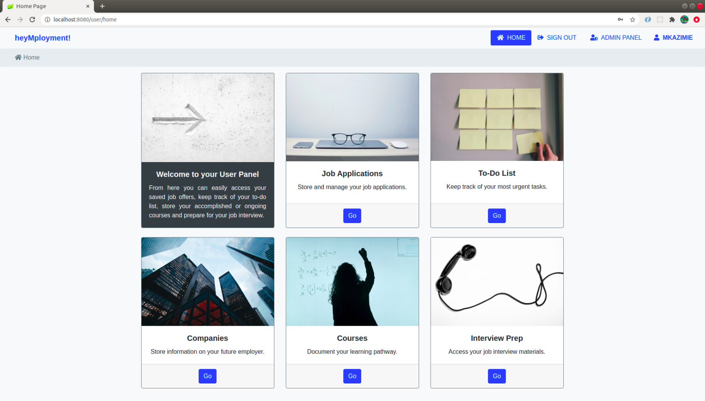
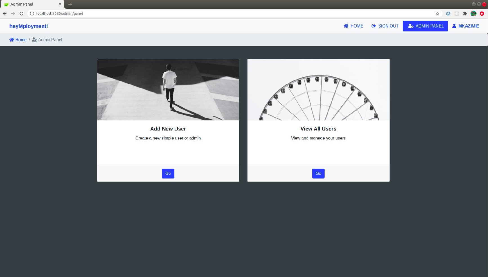

## heyMployment!
### Job Search Organizer created using Spring Boot and MySQL

heyMployment helps you manage your job applications, schedule tasks, prepare for your job interviews and document
 your learning pathway.

#### User Panel


#### Admin Panel



#### Requirements:

* MySQL
* Maven 3+
* Java 8+


#### Setup Steps:

* Clone the application using the command:

```bash
$ git clone https://github.com/mkazimie/heyMployment.git
```
* Import as a Maven Project to your IDE.

* Connect to MySQL using your credentials and create an empty database.

* Go to `src/main/resources/application.properties` and update the datasource url, username and password according to
 your MySQL configuration. The table schema will be created for you in your database.

#### Build and Run the App:

* Run the app from your IDE by making a right click on `HeymploymentApplication.java` file.

* Alternatively, go the project's root folder, then type:

```bash
$ mvn spring-boot:run
```

* The app will start running at http://localhost:8080.